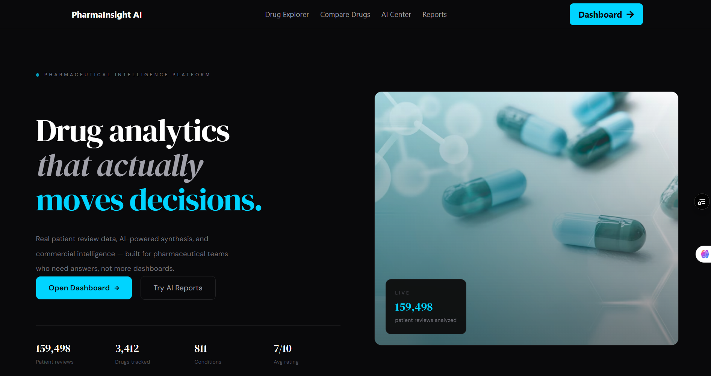
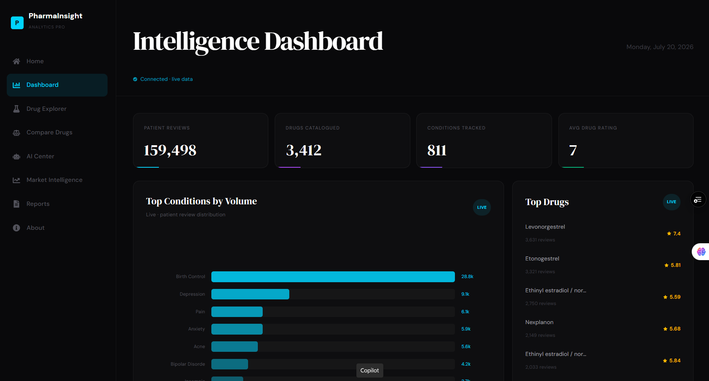
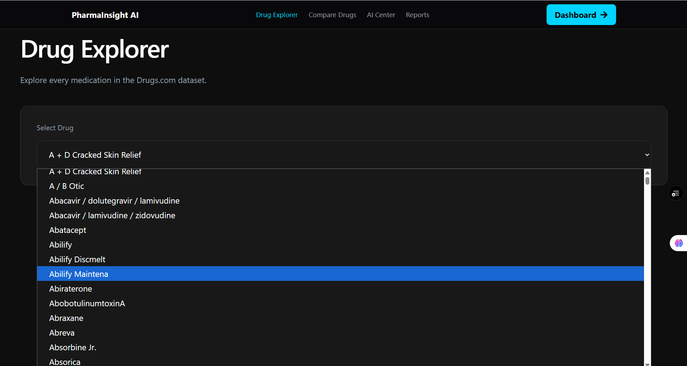
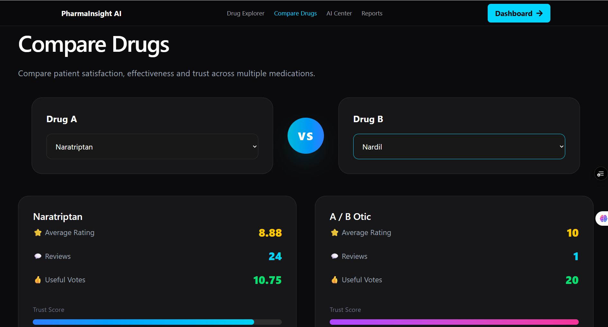
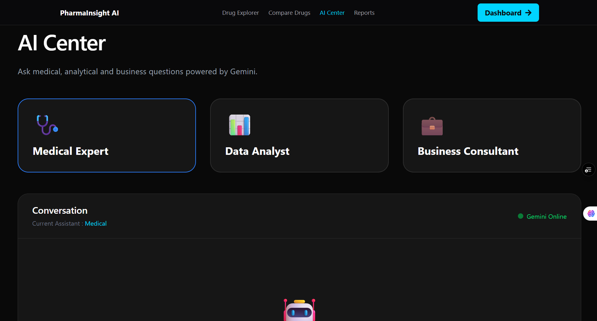
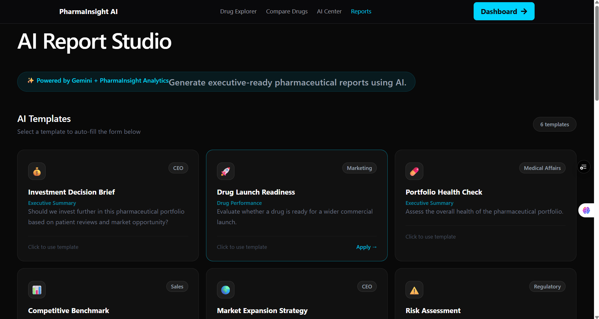
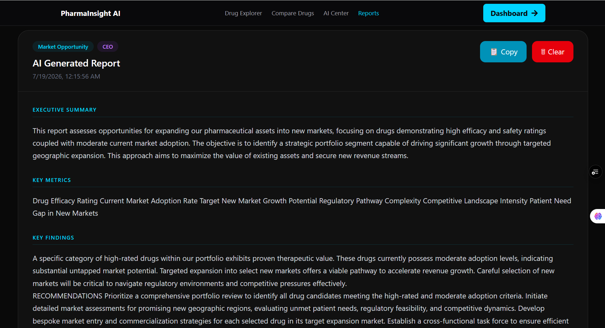

# PharmaInsight AI 💊

An AI-powered pharmaceutical intelligence platform built for drug analytics, patient review analysis, and executive reporting.

**Live Demo:** [pharma-insight-ai.vercel.app](https://pharma-insight-ai.vercel.app/)  
**API:** [pharmainsight-ai.onrender.com](https://pharmainsight-ai.onrender.com)

---

## What it does

PharmaInsight AI analyzes 159,000+ patient drug reviews across 3,400+ drugs and 811 medical conditions, surfacing insights that help pharmaceutical teams make faster, data-driven decisions.

- **Executive Dashboard** — Live KPIs, condition volume charts, top drug ratings, and rating distribution
- **Drug Explorer** — Search and filter drugs by condition, rating, and review volume
- **Compare Drugs** — Side-by-side drug comparison across efficacy, sentiment, and adoption
- **AI Center** — Gemini-powered drug analysis, medical Q&A, and business consulting
- **Market Intelligence** — Competitive positioning and market opportunity analysis
- **Report Studio** — Generate board-ready executive reports with one click

---

## Tech Stack

**Frontend**
- React 18 + Vite
- Tailwind CSS
- React Router
- DM Serif Display + DM Sans (Google Fonts)
- Recharts

**Backend**
- Python + FastAPI
- Pandas
- Google Gemini AI
- Uvicorn

**Infrastructure**
- Vercel (frontend)
- Render (backend)
- UptimeRobot (uptime monitoring)

---

## Project Structure

```text
pharmainsight/
├── frontend-app/
│   ├── src/
│   │   ├── pages/
│   │   │   ├── Landing.jsx
│   │   │   ├── Dashboard.jsx
│   │   │   ├── DrugExplorer.jsx
│   │   │   ├── CompareDrugs.jsx
│   │   │   ├── AICenter.jsx
│   │   │   ├── MarketIntelligence.jsx
│   │   │   ├── Reports.jsx
│   │   │   └── About.jsx
│   │   ├── components/
│   │   │   └── Navbar.jsx
│   │   ├── services/
│   │   │   └── api.js
│   │   └── ...
│   └── public/
│
└── backend/
    ├── app/
    │   ├── api.py
    │   ├── analytics.py
    │   ├── data_service.py
    │   ├── medical_assistant.py
    │   ├── data_analyst.py
    │   └── business_consultant.py
    └── data/
        └── processed/
            └── cleaned_drugs.csv
```
---

## Getting Started

### Prerequisites
- Node.js 18+
- Python 3.10+
- Google Gemini API key

### Frontend

```bash
cd frontend-app
npm install
npm run dev
```

Create `.env` in `frontend-app/`:
VITE_API_URL=http://localhost:8000
### Backend

```bash
cd backend
python -m venv .venv
.venv\Scripts\activate        # Windows
source .venv/bin/activate     # Mac/Linux

pip install -r requirements.txt
uvicorn app.api:app --reload
```

Create `.env` in `backend/`:
GEMINI_API_KEY=your_gemini_api_key
---

## API Endpoints

| Method | Endpoint | Description |
|--------|----------|-------------|
| GET | `/` | Health check |
| GET | `/dashboard/kpis` | Total reviews, drugs, conditions, avg rating |
| GET | `/dashboard/top-conditions` | Top 5 conditions by review volume |
| GET | `/dashboard/charts` | Top 8 conditions for chart display |
| GET | `/dashboard/top-drugs` | Top 6 drugs by rating |
| GET | `/dashboard/rating-distribution` | Rating breakdown across catalogue |
| GET | `/drugs` | All drug names |
| GET | `/drugs/{name}` | Drug details and reviews |
| POST | `/ai/ask` | AI assistant query |
| POST | `/reports/generate` | Generate executive report |

---

## Dataset

Based on the [UCI Drug Review Dataset](https://www.kaggle.com/datasets/jessicali9530/kuc-hackathon-winter-2018) containing patient reviews for drugs across hundreds of medical conditions.

- 159,000+ patient reviews
- 3,400+ unique drugs
- 811 medical conditions
- Ratings from 1–10

---

## Deployment

### Frontend → Vercel
1. Push to GitHub
2. Import repo in Vercel
3. Add environment variable: `VITE_API_URL=https://your-backend.onrender.com`
4. Deploy

### Backend → Render
1. Push to GitHub
2. Create new Web Service on Render
3. Build command: `pip install -r requirements.txt`
4. Start command: `uvicorn app.api:app --host 0.0.0.0 --port $PORT`
5. Add environment variable: `GEMINI_API_KEY=your_key`
6. Deploy

---

# 📸 Application Preview

| Home | Dashboard |
|------|-----------|
|  |  |

| Drug Explorer | Compare Drugs |
|---------------|---------------|
|  |  |

| AI Centre | Report Studio |
|-----------|---------------|
|  |  |

### AI Report Example

<p align="center">

</p>

---

## Author

Built by **Nasreen Nadaf**  
[LinkedIn](https://www.linkedin.com/in/nasreen-nadaf-2b0973368/) · [GitHub](https://github.com/nasreennadaf)

